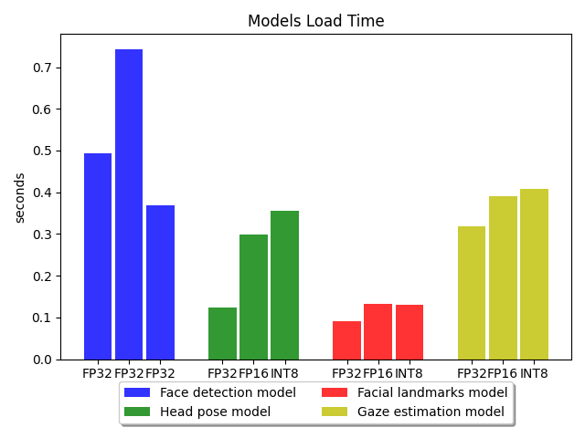
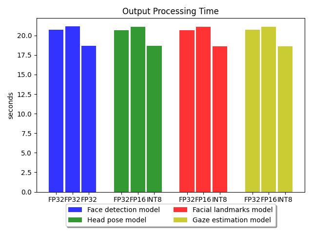
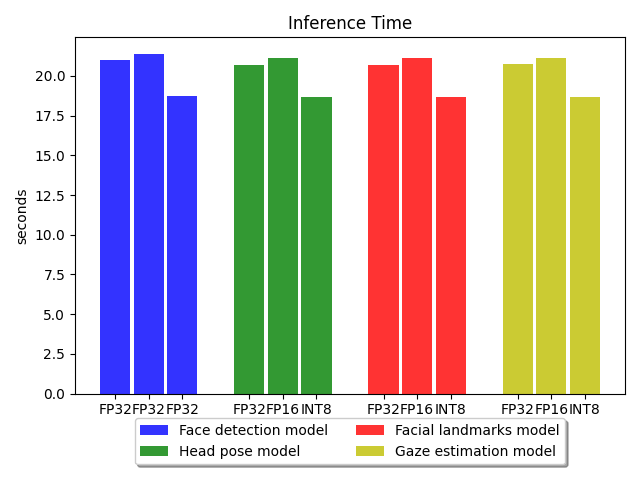
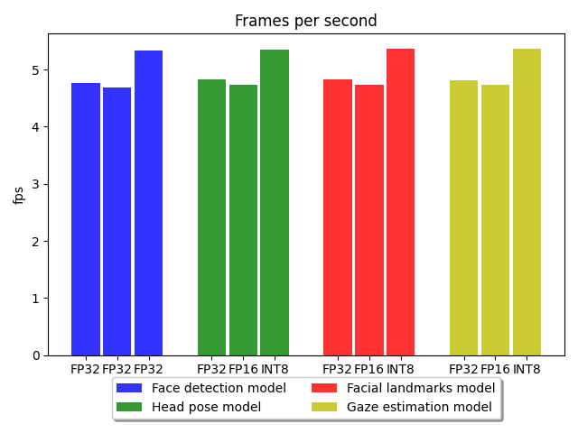

# Computer Pointer Controller

This project translates eyes' gaze direction (from image, video or cam) to mouse pointer movement on computer, using Intel's OpenVINO Toolkit with four models:

- [Face detection model](https://docs.openvinotoolkit.org/latest/omz_models_intel_face_detection_adas_binary_0001_description_face_detection_adas_binary_0001.html): Detects the face from the input (image, video or cam), cropping it and pass it for other models.
- [Head pose model](https://docs.openvinotoolkit.org/latest/omz_models_intel_head_pose_estimation_adas_0001_description_head_pose_estimation_adas_0001.html): Detects the head pose movement and direction.
- [Facial landmarks model](https://docs.openvinotoolkit.org/latest/omz_models_intel_landmarks_regression_retail_0009_description_landmarks_regression_retail_0009.html): Detects the left and right eyes.
- [Gaze estimation model](https://docs.openvinotoolkit.org/latest/omz_models_intel_gaze_estimation_adas_0002_description_gaze_estimation_adas_0002.html): Gets the head pose and eyes images from other models, and detects the eyes' gaze direction.


Image source: (Udacity's courseware)

## Project Set Up and Installation
- Install Intel OpenVino version 2020.4.287 or later, please follow Intels's guide based on OS:  
-[Windows](https://docs.openvinotoolkit.org/latest/openvino_docs_install_guides_installing_openvino_windows.html)  
-[Windows FPGA](https://docs.openvinotoolkit.org/latest/openvino_docs_install_guides_installing_openvino_windows_fpga.html)  
-[Windows Docker](https://docs.openvinotoolkit.org/latest/openvino_docs_install_guides_installing_openvino_docker_windows.html)  
-[Linux](https://docs.openvinotoolkit.org/latest/openvino_docs_install_guides_installing_openvino_linux.html)  
-[Linux FPGA](https://docs.openvinotoolkit.org/latest/openvino_docs_install_guides_installing_openvino_linux_fpga.html)  
-[Linux Docker](https://docs.openvinotoolkit.org/latest/openvino_docs_install_guides_installing_openvino_docker_linux.html)  
-[macOS](https://docs.openvinotoolkit.org/latest/openvino_docs_install_guides_installing_openvino_macos.html)  
-[Raspbian* OS](https://docs.openvinotoolkit.org/latest/openvino_docs_install_guides_installing_openvino_raspbian.html)

- Create and activate Virtual Enviroment
  ```
  python3 -m venv pointer_env
  source pointer_env/bin/activate
  ```
- Install requirements from requirements.txt
  ```
  pip install -r requirements.txt
  ```
- Run OpenVINO's environment setup
  ```
  source /opt/intel/openvino/bin/setupvars.sh
  ```
- Download all models to `models/` directory is prefered
  ```
  python3 /opt/intel/openvino/deployment_tools/open_model_zoo/tools/downloader/downloader.py \
  --name landmarks-regression-retail-0009 -o models

  python3 /opt/intel/openvino/deployment_tools/open_model_zoo/tools/downloader/downloader.py \
  --name head-pose-estimation-adas-0001 -o models

  python3 /opt/intel/openvino/deployment_tools/open_model_zoo/tools/downloader/downloader.py \
  --name face-detection-adas-binary-0001 -o models

  python3 /opt/intel/openvino/deployment_tools/open_model_zoo/tools/downloader/downloader.py \
  --name gaze-estimation-adas-0002 -o models
  ```
- Directory structure should be as follows:
  ```
  ├── bin
  │   └── demo.mp4
  ├── models
  │   └── intel
  │       ├── face-detection-adas-binary-0001
  │       │   └── FP32-INT1
  │       │       ├── face-detection-adas-binary-0001.bin
  │       │       └── face-detection-adas-binary-0001.xml
  │       ├── gaze-estimation-adas-0002
  │       │   ├── FP16
  │       │   │   ├── gaze-estimation-adas-0002.bin
  │       │   │   └── gaze-estimation-adas-0002.xml
  │       │   ├── FP16-INT8
  │       │   │   ├── gaze-estimation-adas-0002.bin
  │       │   │   └── gaze-estimation-adas-0002.xml
  │       │   └── FP32
  │       │       ├── gaze-estimation-adas-0002.bin
  │       │       └── gaze-estimation-adas-0002.xml
  │       ├── head-pose-estimation-adas-0001
  │       │   ├── FP16
  │       │   │   ├── head-pose-estimation-adas-0001.bin
  │       │   │   └── head-pose-estimation-adas-0001.xml
  │       │   ├── FP16-INT8
  │       │   │   ├── head-pose-estimation-adas-0001.bin
  │       │   │   └── head-pose-estimation-adas-0001.xml
  │       │   └── FP32
  │       │       ├── head-pose-estimation-adas-0001.bin
  │       │       └── head-pose-estimation-adas-0001.xml
  │       └── landmarks-regression-retail-0009
  │           ├── FP16
  │           │   ├── landmarks-regression-retail-0009.bin
  │           │   └── landmarks-regression-retail-0009.xml
  │           ├── FP16-INT8
  │           │   ├── landmarks-regression-retail-0009.bin
  │           │   └── landmarks-regression-retail-0009.xml
  │           └── FP32
  │               ├── landmarks-regression-retail-0009.bin
  │               └── landmarks-regression-retail-0009.xml
  ├── pointer_env
  │   └── ...  
  ├── pipeline.png
  ├── README.md
  ├── requirements.txt
  └── src
      ├── face_detection.py
      ├── facial_landmarks_detection.py
      ├── gaze_estimation.py
      ├── head_pose_estimation.py
      ├── input_feeder.py
      ├── main.py
      ├── model.py
      └── mouse_controller.py
  ```

## Demo
Run the following without any arguments will assume the defaults accoring to the table in the documentation section:
  ```
  python3 src/main.py
  ```

## Documentation

| Arguments  | Description                          | Default value                                                                          |
| ---------- | ------------------------------------ | -------------------------------------------------------------------------------------- |
| -fm        | Face detection model                 | models/intel/face-detection-adas-binary-0001/FP32-INT1/face-detection-adas-binary-0001 |
| -gm        | Gaze estimation model                | models/intel/gaze-estimation-adas-0002/FP16/gaze-estimation-adas-0002                  |
| -hm        | Head pose model                      | models/intel/head-pose-estimation-adas-0001/FP16/head-pose-estimation-adas-0001        |
| -lm        | Facial landmarks model               | models/intel/landmarks-regression-retail-0009/FP16/landmarks-regression-retail-0009    |
| -if        | Input File path                      | bin/demo.mp4                                                                           |
| -it        | Input Type (File/CAM)                | file                                                                                   |
| -l         | Extensions                           | None                                                                                   |
| -d         | Device                               | CPU                                                                                    |
| -t         | Threshold                            | 0.5                                                                                    |
| -bm        | Benchmark models                     | False                                                                                  |
| -p         | Show frames preview while predection | True                                                                                   |

Running with --help will print the following:
```
python3 src/main.py --help
usage: main.py [-h] [-fm FACEMODEL] [-gm GAZEMODEL] [-hm HEADMODEL]
               [-lm LANDMARKSMODEL] [-if INPUTFILE] [-it INPUTTYPE]
               [-l CPU_EXTENSION] [-d DEVICE] [-t THRESHOLD] [-bm BENCHMARK]
               [-p PREVIEW]

optional arguments:
  -h, --help            show this help message and exit
  -fm FACEMODEL, --facemodel FACEMODEL
                        Path to face detection model (default is models/face-
                        detection-adas-binary-0001models/intel/face-detection-
                        adas-binary-0001/FP32-INT1/face-detection-adas-
                        binary-0001)
  -gm GAZEMODEL, --gazemodel GAZEMODEL
                        Path to gaze estimation model (default is models/gaze-
                        estimation-adas-0002/FP16/gaze-estimation-adas-0002)
  -hm HEADMODEL, --headmodel HEADMODEL
                        Path to head pose estimation model (default is
                        models/head-pose-estimation-adas-0001/FP16/head-pose-
                        estimation-adas-0001)
  -lm LANDMARKSMODEL, --landmarksmodel LANDMARKSMODEL
                        Path to landmarks regression model (default is
                        models/landmarks-regression-
                        retail-0009/FP16/landmarks-regression-retail-0009)
  -if INPUTFILE, --inputfile INPUTFILE
                        Path to video file (default is bin/demo.mp4)
  -it INPUTTYPE, --inputtype INPUTTYPE
                        input type (file or cam) (file by default)
  -l CPU_EXTENSION, --cpu_extension CPU_EXTENSION
                        MKLDNN (CPU)-targeted custom layers.Absolute path to a
                        shared library with the kernels impl. (None by
                        default)
  -d DEVICE, --device DEVICE
                        Specify the target device to infer on: CPU, GPU, FPGA
                        or MYRIAD is acceptable. Sample will look for a
                        suitable plugin for device specified (CPU by default)
  -t THRESHOLD, --threshold THRESHOLD
                        Probability threshold for detections filtering (0.5 by
                        default)
  -bm BENCHMARK, --benchmark BENCHMARK
                        Run benchmark and calculate Model load time,
                        Input/Output processing time and Inference time for
                        each model (False by default)
  -p PREVIEW, --preview PREVIEW
                        Show frames preview while predection (True by default)
```
## Benchmarks
Run the following script will start benchmaking all models' percissions and results to output directory:
  ```
  ./benchmark.sh 
  ```
*Results as below:*   

  
  
  
  
  


## Results
Please note: CPU only was used in this project (inside Virtual Machine), which should works only on FP32.

But, INT8 (as seen on charts above) gives a better results. Also if iGPU is used will give better results.

## Stand Out Suggestions
None

### Async Inference
Used Async Inference made the CPU more free to make other instructions which increases the performance and save power.

### Edge Cases
Testing with multiple faces was not applicable, but I believe the face detection model will output only one face at a time, the mouse pointer may get the coordinates from a different face each iteration (depend on the face detection model).
